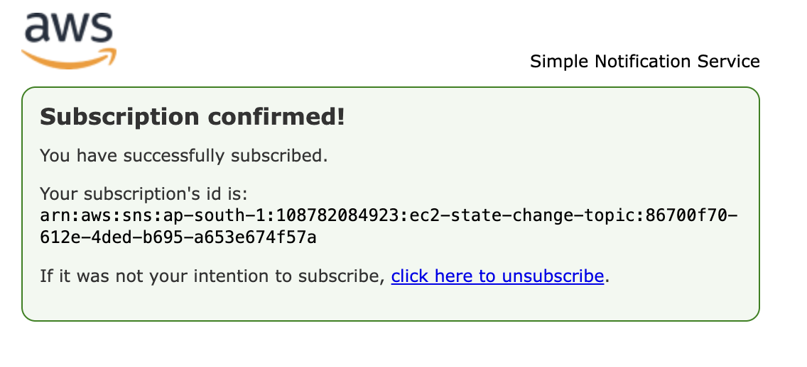
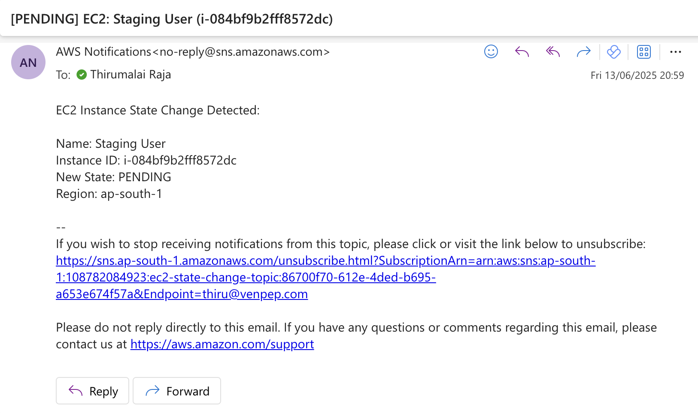
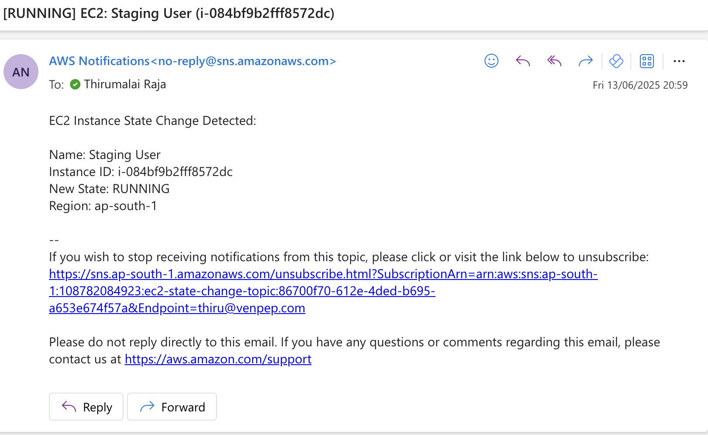
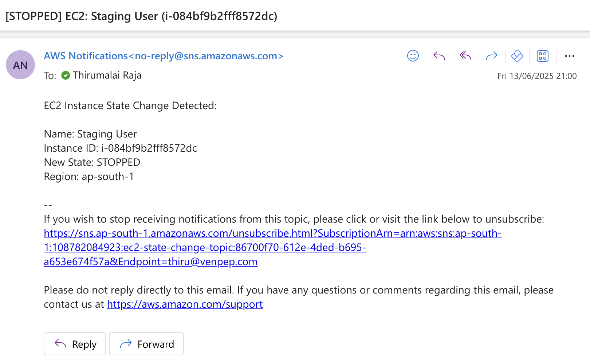

# EC2 Instance State Change Monitor (AWS Lambda + SNS + EventBridge)

This project monitors EC2 instance state changes (e.g., `running`, `stopped`) and sends notifications via Amazon SNS whenever a change occurs. It uses an AWS Lambda function triggered by Amazon EventBridge rules and leverages boto3 to fetch EC2 metadata (like instance name).


## ✅ Features

- 🔔 Real-time notifications for EC2 instance state changes
- 📬 Email alerts with instance name, ID, state, and region
- 🛠️ Event-driven, no polling required
- 🔐 Uses IAM best practices and environment variables


## 🗉 Architecture

`EC2 Instance → State Change → EventBridge Rule → Lambda Function → SNS Email`

## 🛠️ Setup Instructions

### 1. Create an SNS Topic

 - Go to Amazon SNS → Topics → Create topic
 - Choose Standard, name it (e.g., ec2-state-alerts)
 - Create a subscription with your email address
 - Confirm the subscription via email

### 2. Create the Lambda Function

 - Runtime: Python 3.9+
 - Set environment variable: `SNS_TOPIC_ARN`
 - Attach the IAM permissions for SNS, Cloudwatch, ECReadonly


### 3. Create the EventBridge Rule

 - Go to EventBridge → Rules → Create rule
 - Event source: AWS events
 - Event pattern:

    ```
    {
        "source": ["aws.ec2"],
        "detail-type": ["EC2 Instance State-change Notification"],
        "detail": {
            "state": ["pending", "running", "stopped"]
        }
    }
    ```

## ✅ Real Test

- Go to EC2 Console
- Start or stop an instance
- Wait ~1–2 minutes
- Check your email for the alert

## Output

### Accept SNS Topic

Email received for SNS subscription


Accepted Success




### Pending Alert Email



### Running Alert Email



### Stopped Alert Email

